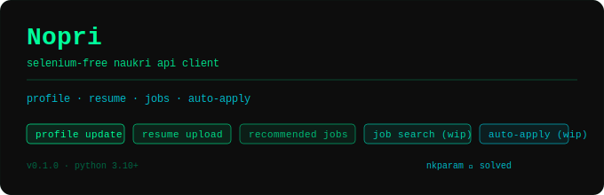

<p align="center">
  
</p>

<h1 align="center">Noperi</h1>

<p align="center">
  A lightweight, Selenium-free Python API client for <a href="https://www.naukri.com">Naukri.com</a>.<br/>
  Login, update your profile, upload a resume, search jobs, and one-click apply — programmatically.
</p>

<p align="center">
  
  
  
</p>

---

## Features

| Feature                                     | Status           |
| ------------------------------------------- | ---------------- |
| Login & session management (Bearer token)   | ✅               |
| Resume upload (PDF)                         | ✅               |
| Profile update (headline, name, summary)    | ✅               |
| Recommended jobs feed                       | ✅               |
| Job search (`/jobapi/v3/search`)            | ✅               |
| One-click easy apply                        | ✅               |
| `nkparam` generator (pure API, no Selenium) | ✅               |
| `nkparam` harvester (Selenium fallback)     | ✅               |
| OTP login / MFA                             | 🚧 In progress   |
| Questionnaire-based applications            | 🚧 In progress   |

> No Selenium required for core features. The Selenium-based harvester is retained only as a backup utility.

---

## Installation

Requirements: **Python 3.10+**

```bash
git clone https://github.com/Mohit-Singh2003/Noperi.git
cd Noperi
pip install -r requirements.txt
```

Create a `.env` file in the project root:

```env
USERNAME=your_naukri_email@example.com
PASSWORD=your_naukri_password
```

---

## Quick Start

Run the included demo:

```bash
python main.py
```

Or use the client directly:

```python
from src.client.naukri_client import NaukriLoginClient
from src.client.job_client import NaukriJobClient
from dotenv import load_dotenv
import os
import time

load_dotenv()

# 1. Login
client = NaukriLoginClient(os.getenv("USERNAME"), os.getenv("PASSWORD"))
client.login()

# 2. Upload resume
client.update_resume("path/to/your_resume.pdf")

# 3. Update profile
client.update_profile(
    headline="Backend Engineer | Python · Node.js · AWS",
    summary="Experienced engineer with 2+ years building scalable APIs.",
)

# 4. Search and apply
jc = NaukriJobClient(client)
jobs = jc.search_jobs(keyword="Node.js developer", location="Hyderabad", experience=2)

for job in jobs:
    try:
        result = jc.apply_job(
            job,
            mandatory_skills=job.tags[:2],
            optional_skills=job.tags[2:],
            source="recommended",
        )
        job_result = (result.get("jobs") or [{}])[0]
        if job_result.get("questionnaire"):
            print("Skipped (questionnaire):", job.title)
            continue
        print("Applied:", job.title)
    except Exception as e:
        print("Failed:", job.title, "|", e)
    time.sleep(2)
```

---

## API Reference

### `NaukriLoginClient`

| Method                                    | Description                                           |
| ----------------------------------------- | ----------------------------------------------------- |
| `login()`                                 | Authenticate; store Bearer token and session cookies  |
| `update_resume(file)`                     | Upload a PDF resume (path string or file-like object) |
| `update_profile(headline, name, summary)` | Update any subset of profile fields                   |
| `fetch_profile_id()`                      | Return your profile ID (cached)                       |
| `get_form_key2()`                         | Extract internal `formKey` from Naukri's JS (cached)  |

### `NaukriJobClient`

| Method                                                  | Description                                |
| ------------------------------------------------------- | ------------------------------------------ |
| `get_recommended_jobs()`                                | List of `Job` objects tailored to profile  |
| `search_jobs(keyword, location, page, experience, ...)` | Search results from Naukri's search API    |
| `apply_job(job, ...)`                                   | Apply to a job programmatically            |

### `Job` model

```python
@dataclass
class Job:
    job_id:      str
    title:       str
    company:     str
    location:    str
    experience:  str
    salary:      str
    posted_date: str
    apply_link:  str
    description: str
    tags:        list[str]
```

---

## The `nkparam` Problem

Naukri's search endpoint (`/jobapi/v3/search`) requires an `nkparam` request header. It is not a static token — it is a time-salted signature derived from session data and page context, computed inside Naukri's obfuscated JavaScript bundle. Missing or invalid values return `403 Forbidden`.

**Solution:** Noperi regenerates `nkparam` natively via API logic (no browser). A Selenium-based harvester is available as a fallback and stores captured tokens in `nkPool.txt`.

```bash
python -m src.utils.get_Nkparam   # optional fallback
```

---

## Using Recommended Jobs as an Agent Feed

`get_recommended_jobs()` returns plain Python dataclasses, making the output easy to pipe into an LLM agent, a Notion database, a Telegram bot, etc.:

```python
for job in jc.get_recommended_jobs():
    your_agent.process({
        "title":    job.title,
        "company":  job.company,
        "location": job.location,
        "skills":   job.tags,
        "url":      job.apply_link,
    })
```

---

## Project Structure

```
Noperi/
├── main.py                     # Demo entry point
├── tui.py                      # Terminal UI
├── updateDaily.py              # Scheduled daily profile update
├── nkPool.txt                  # Captured nkparam pool
├── .env                        # Credentials
└── src/
    ├── client/
    │   ├── naukri_client.py    # Auth + profile + resume
    │   ├── job_client.py       # Recommended, search, apply
    │   └── session.py          # requests.Session factory
    ├── config/constants.py     # URLs, regex, app IDs
    ├── exceptions/             # Custom exceptions
    ├── models/models.py        # Job, NaukriSession, ...
    └── utils/
        ├── extractors.py           # HTML / JS parsing helpers
        ├── request_helper.py       # Exponential-retry decorator
        ├── get_Nkparam.py          # Selenium harvester (fallback)
        └── nkparam_generator.py    # Pure-API nkparam generator
```

---

## Hosting & IP Advice

Naukri fingerprints IPs per request. Many datacenter networks trigger MFA or outright blocks.

**Works:** AWS EC2 (with Elastic IP), home broadband, mobile hotspot, residential proxy
**Avoid:** Azure (all regions), GitHub Actions runners, some GCP regions, generic datacenter IPs

Sessions are IP-bound — switching IPs invalidates the login.

---

## Roadmap

- [x] Job-search endpoint integration
- [x] One-click apply flow
- [ ] Async support (`httpx` / `aiohttp`)
- [ ] First-class CLI interface
- [ ] OTP / MFA login
- [ ] Questionnaire-based application support

---

## Contributing

Pull requests are welcome. OTP/MFA login automation is the main remaining piece for a fully seamless client — help wanted.

---

## Disclaimer

This project is intended for personal automation of your **own** Naukri account. Use responsibly and in accordance with [Naukri's Terms of Service](https://www.naukri.com/termsAndConditions). The authors are not affiliated with Naukri or InfoEdge India Ltd.
